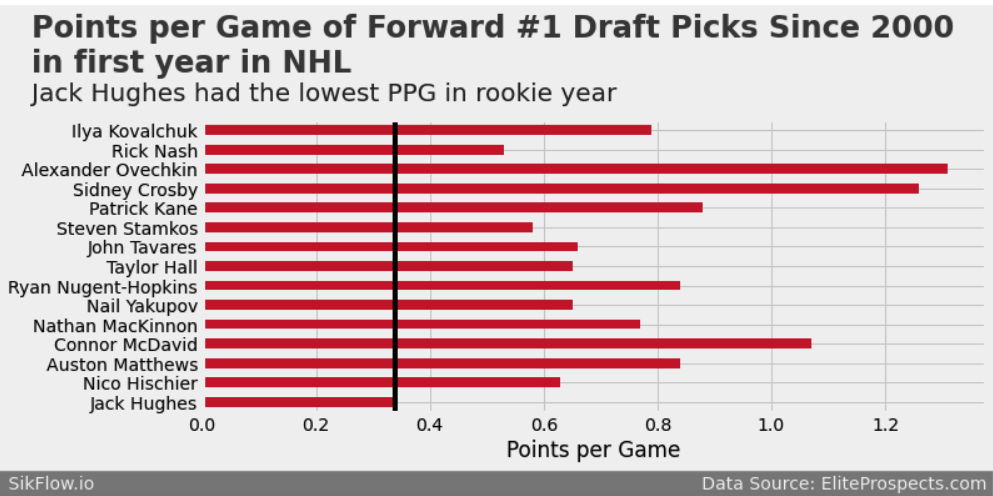
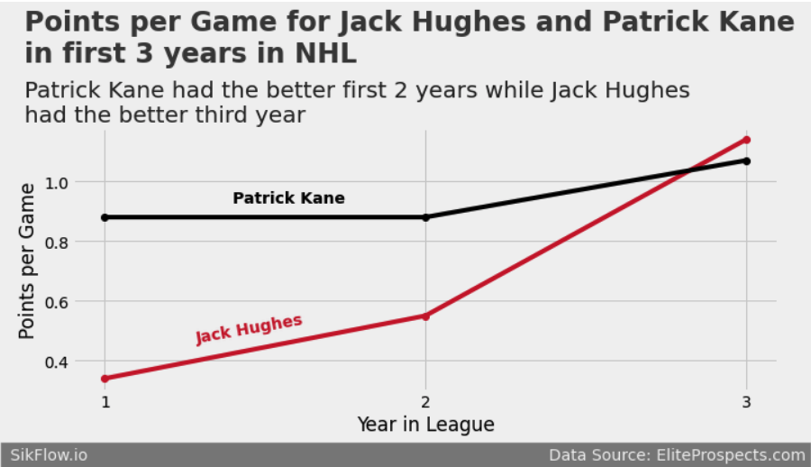
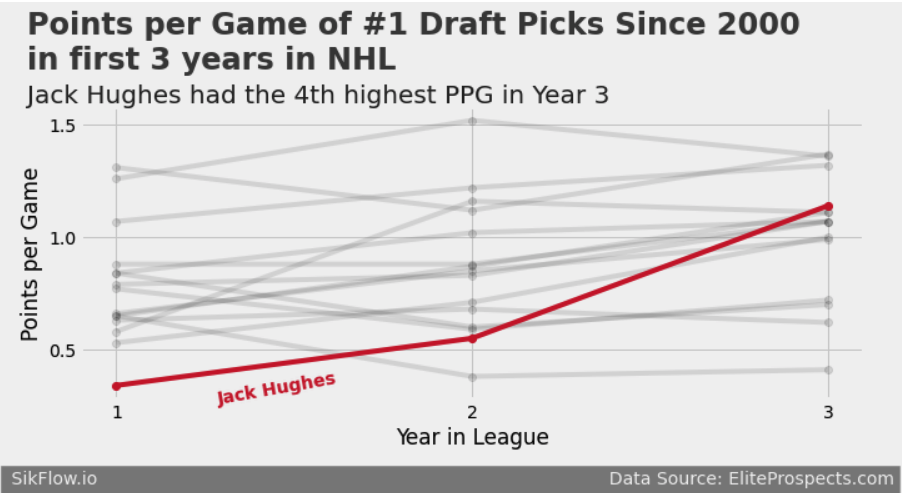

## Rookie Season

Jack Hughes was drafted with the number one overall selection in the 2019 NHL Draft.  He was a player that was incredibly hyped after scoring 112 points in 50 games with the US National Development Team, getting frequently compared to Patrick Kane.  He scored more points at the US National Development Team than NHL stars - Auston Mathews, Jack Eichel, Clayton Keller, and Patrick Kane.  

I previously looked at Jack Hughes after his rookie season in [this post](https://sikflow.io/2020/04/18/jack-hughes). 

In 2019-2020 Jack Hughes scored 21 points in 61 games during his rookie year.  Let's first look at Jack Hughes’ rookie year compared to other #1 overall draft picks.  The first graph shows the points per game of rookie forwards who were #1 draft picks drafted since 2000.  

We see Jack Hughes had the lowest points per game of any forward drafted #1 overall since 2000.  Seeing these results, it was natural to start thinking that perhaps Jack Hughes was a bust. 

## Progress After Year 3

Now let's look at Jack Hughes's stats for his first 3 seasons - is he still projecting to be a bust or is he showing some of the superstar potential that made him the number one overall draft pick?  To start I am first going to compare the stats of Jack Hughes to the stats of Patrick Kane over their first 3 seasons, if you remember Patrick Kane is who Jack Hughes was frequently compared to.  

We see that Patrick Kane had more points per game then Jack Hughes in his first 2 years and then in the third year Jack Hughes scored at a higher point per game rate.  This is just a comparison to a single player, Patrick Kane, now lets see how he compares to all #1 overall draft picks since 2000.  

We see that Jack Hughes had the lowest points per game in his first year, the 2nd lowest points per game in his second year, and jumped to 4th highest points per game in year 3.  

This just shows the incredible progress Jack Hughes has made in his 3 years in the NHL and I, personally, cannot wait to see what he does in year 4! 
